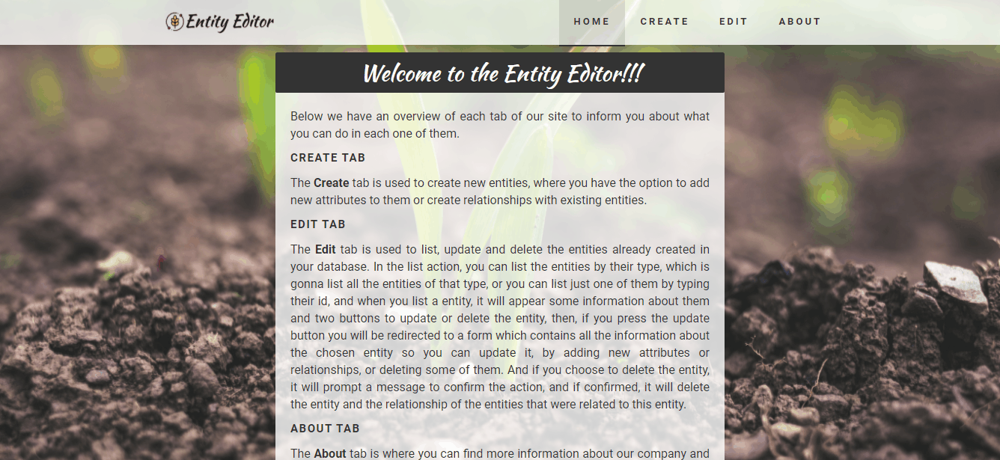
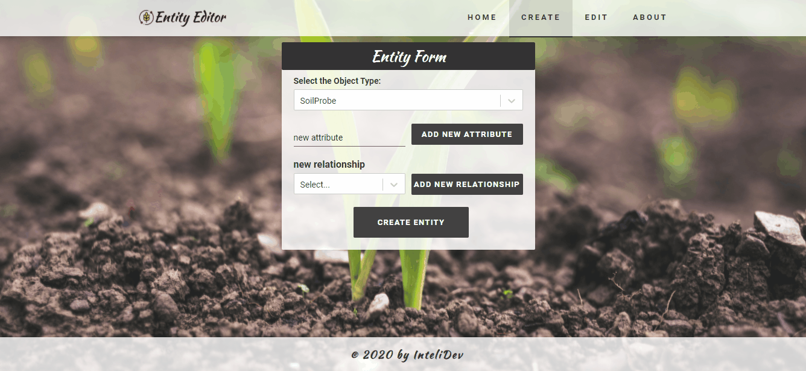
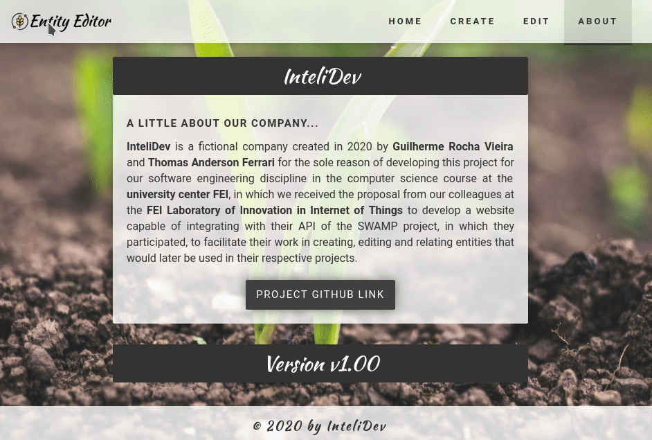

<p align="center">
  

  
  
  <a href="https://github.com/grochavieira/EntityEditor/commits/master">
    
  </a>
    
   

  <a href="https://github.com/grochavieira">
    
  </a>
  
 
</p>
<h1 align="center">
    
</h1>

<h4 align="center"> 
	🚧  Site Concluído 🚧
</h4>

## 🏁 Tópicos

<p>
 👉<a href="#-sobre-o-projeto" style="text-decoration: none; "> Sobre</a> <br/>
👉<a href="#-funcionalidades" style="text-decoration: none; "> Funcionalidades</a> <br/>
👉<a href="#-layout" style="text-decoration: none"> Layout</a> <br/>
👉<a href="#-como-executar-o-projeto" style="text-decoration: none"> Como executar</a> <br/>
👉<a href="#-tecnologias" style="text-decoration: none"> Tecnologias</a> <br/>
👉<a href="#-autor" style="text-decoration: none"> Autor</a> <br/>
👉<a href="#user-content--licença" style="text-decoration: none"> Licença</a>

</p>

## 💻 Sobre o projeto

Projeto de Engenharia de Software - Site para criar e editar entidades em formato JSON e envia-las para o context-broker ORION.

---

<a name="-funcionalidades"></a>

## ⚙️ Funcionalidades

- [x] Página Home com um breve resumo do propósito da aplicação.

- [x] Entidades podem ser criadas:

  - [x] Com os tipos disponíveis (SoilProbe, ManagementZone, Farm e Farmer);
  - [x] Adicionando novos atributos, sem serem repetidos, dos tipos Text e Number;
  - [x] Adicionando novos relacionamentos (se estiverem disponíveis);
  - [x] Sem a adição das opções anteriores.

- [x] Entidades podem ser listadas:

  - [x] Por meio de uma pesquisa por ID;
  - [x] Por meio de uma pesquisa por Tipo;
  - [x] Totalmente.

- [x] Entidades podem ser deletadas.

- [x] Entidades podem ser atualizadas:

  - [x] Adicionando Atributos;
  - [x] Deletando Atributos;
  - [x] Adicionando Relacionamentos;
  - [x] Deletando Relacionamentos.

- [x] Pagína About com mais informações sobre os desenvolvedores.

---

## 🎨 Layout

### Página Home:

<p align="center">
    
</p>

### Página Create (Entities):

<p align="center">
    
</p>

### Demonstração de Relacionamento entre Entidades:

<p align="center">
    
</p>

### Demonstração de Paginação:

<p align="center">
    
</p>

### Demonstração de Pesquisa por ID e Tipo da Entidade:

<p align="center">
    
</p>

### Demonstração de Atualização de Entidades:

<p align="center">
    
</p>

### Demonstração de Exclusão de Entidades:

<p align="center">
    
</p>

### Página About:

<p align="center">
    
</p>

---

## 🚀 Como executar o projeto

Este projeto é divido em duas partes:

1. Backend (pasta docker)
2. Frontend (pasta web)

💡O Frontend precisa que o Backend esteja sendo executado para funcionar.

### Pré-requisitos

Antes de começar, você vai precisar ter instalado em sua máquina as seguintes ferramentas:
[Git](https://git-scm.com), [Node.js](https://nodejs.org/en/), [Yarn](https://classic.yarnpkg.com/en/docs/install) e [Docker](https://www.docker.com/).
Além disto é bom ter um editor para trabalhar com o código como [VSCode](https://code.visualstudio.com/)

#### 🎲 Rodando o Backend (servidor)

```bash

# Clone este repositório
$ git clone https://github.com/grochavieira/EntityEditor.git

# Acesse a pasta do projeto no terminal/cmd
$ cd EntityEditor

# Vá para a pasta docker
$ cd docker

# Execute a docker (lembrando que o docker precisa ser inicializado primeiro)
$ docker-compose -f docker-compose-dev.yml up -d

# O docker utilizara a porta 1026 - acesse http://localhost:1026/v2/entities

```

#### 🧭 Rodando a aplicação web (Frontend)

```bash

# Clone este repositório
$ git clone https://github.com/grochavieira/EntityEditor.git

# Acesse a pasta do projeto no seu terminal/cmd
$ cd EntityEditor

# Vá para a pasta da aplicação Front End
$ cd web

# Instale as dependências
$ yarn install

# Execute a aplicação em modo de desenvolvimento
$ yarn start

# A aplicação será aberta na porta:3000 - acesse http://localhost:3000

```

---

## 🛠 Tecnologias

As seguintes ferramentas foram usadas na construção do projeto:

#### **Website** ([React](https://reactjs.org/))

- **[React Router Dom](https://github.com/ReactTraining/react-router/tree/master/packages/react-router-dom)**
- **[React Icons](https://react-icons.github.io/react-icons/)**
- **[Axios](https://github.com/axios/axios)**
- **[Unform](https://github.com/Rocketseat/unform)**
- **[React Select](https://react-select.com/home)**

> Veja o arquivo [package.json](https://github.com/grochavieira/EntityEditor/blob/master/web/package.json)

#### **Utilitários**

- Editor: **[Visual Studio Code](https://code.visualstudio.com/)** → Extensions: **[SQLite](https://marketplace.visualstudio.com/items?itemName=alexcvzz.vscode-sqlite)**
- Teste de API: **[Insomnia](https://insomnia.rest/)**
- Ícones: **[Feather Icons](https://feathericons.com/)**, **[Font Awesome](https://fontawesome.com/)**, **[Ionicons](https://ionicons.com/)**
- Fontes: **[Roboto](https://fonts.google.com/specimen/Roboto)**, **[Kaushan Script](https://fonts.google.com/specimen/Kaushan+Script)**

---

<a name="-autor"></a>

## 🦸‍♂️ **Autor**

<p>
<kbd>
 
 </kbd>
 <br />
 <sub><strong>🌟 Guilherme Rocha Vieira 🌟</strong></sub>
</p>

[](https://www.linkedin.com/in/grochavieira/)
[](mailto:guirocha.hopeisaba@gmail.com)

---

## 📝 Licença

Este projeto esta sobe a licença [MIT](./LICENSE).

Feito com :satisfied: por Guilherme Rocha Vieira 👋🏽 [Entre em contato!](https://www.linkedin.com/in/grochavieira/)

---
